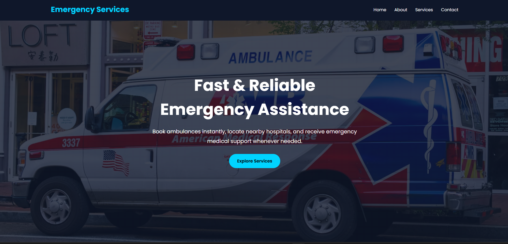
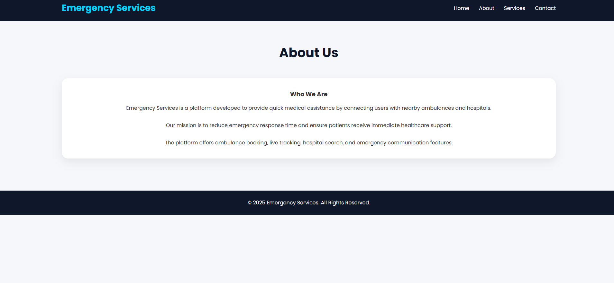
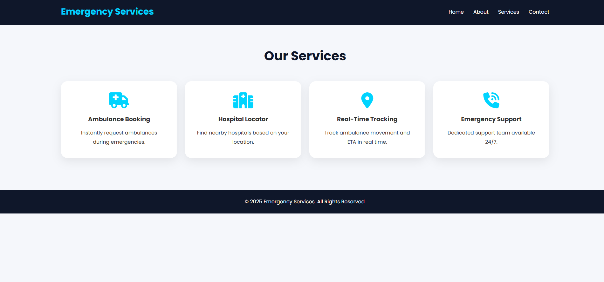
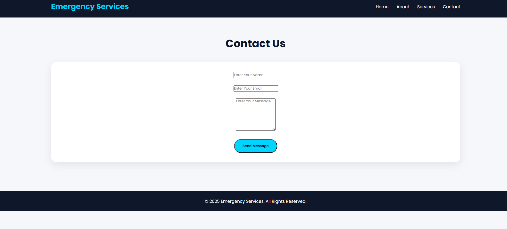

# 🚑 Emergency Services Website

A responsive multi-page website developed as part of the **Synent Technologies Web Development Internship Program**.

The website is designed to provide quick access to emergency services and important information through a professional and user-friendly interface.

---

# 🚀 Features

## 🏠 Home Page

- Attractive Hero Section
- Emergency Assistance Information
- Quick Navigation
- Responsive Layout

## ℹ️ About Page

- Information about the organization
- Mission and Vision
- Service Overview

## 🛠️ Services Page

Provides information about:

- Ambulance Services
- Police Assistance
- Fire & Rescue Services
- Medical Emergency Support

## 📞 Contact Page

- Contact Form
- Emergency Contact Details
- Email Information
- Location Details

## 📱 Responsive Design

Fully optimized for:

- Desktop
- Laptop
- Tablet
- Mobile Devices

## 🎨 Modern User Interface

- Clean Design
- Easy Navigation
- Mobile Friendly
- Professional Layout

---

# 🛠️ Technologies Used

- HTML5
- CSS3
- JavaScript

---

# 📂 Project Structure

```text
synent-task7-emergencyserviceswebsite-dileep
│
├── index.html
├── about.html
├── services.html
├── contact.html
│
├── css
│   └── style.css
│
├── js
│   └── script.js
│
├── screenshots
│   ├── home.png
│   ├── about.png
│   ├── services.png
│   └── contact.png
│
└── README.md
```

---

# 📸 Screenshots

## 🏠 Home Page



## ℹ️ About Page



## 🛠️ Services Page



## 📞 Contact Page



---

# 🎯 Internship Task Details

### Task Number

Task 7 – Multi-Page Website

### Objective

Build a complete responsive multi-page website containing:

- Home Page
- About Page
- Services Page
- Contact Page

### Requirements Implemented

✅ Multi-Page Navigation

✅ Responsive Design

✅ Professional UI

✅ Mobile Friendly Layout

✅ Consistent Design Across Pages

---

# 🌍 Live Demo

### Emergency Services Website

🔗 Live Website Link:

---

# 🎥 Demo Video

### Project Demonstration

🔗 YouTube Video Link:

---

# 📝 Internship Experience Blog

### Synent Technologies Internship Experience

🔗 Blog Link:

https://medium.com/@dileepguguloth2005/my-internship-experience-at-synent-technologies-f3e27fa41924

---

# 👨‍💻 Author

## Dileep Guguloth

📧 Email:
[dileepguguloth26@gmail.com](mailto:dileepguguloth26@gmail.com)

🔗 GitHub:
https://github.com/Dileep2609

🔗 LinkedIn:
https://www.linkedin.com/in/dileep-guguloth-b04416300

---

# 🏢 Internship

**Synent Technologies – Web Development Internship Program**

---

# ⭐ Learning Outcomes

Through this project, I learned:

- Multi-Page Website Development
- Responsive Web Design
- Navigation Systems
- Layout Structuring
- UI/UX Design Principles
- Frontend Development Best Practices

---

# ⭐ Acknowledgement

I would like to thank **Synent Technologies** for providing this internship opportunity and helping me gain practical experience in responsive website development and modern web design.

---

## 📌 Repository Name

```text
synent-task7-emergencyserviceswebsite-dileep
```
